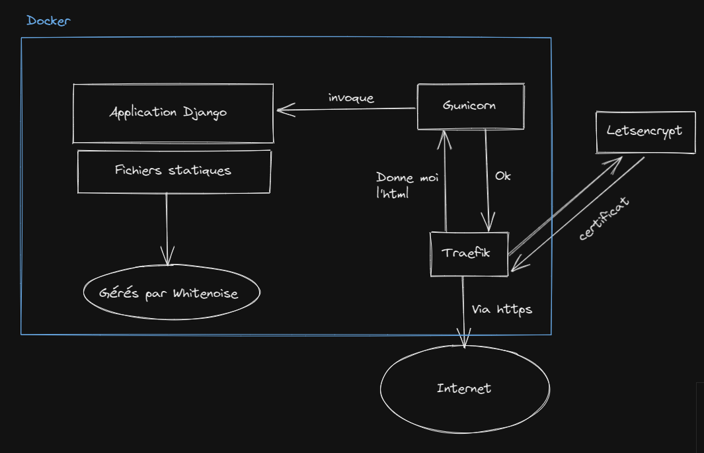
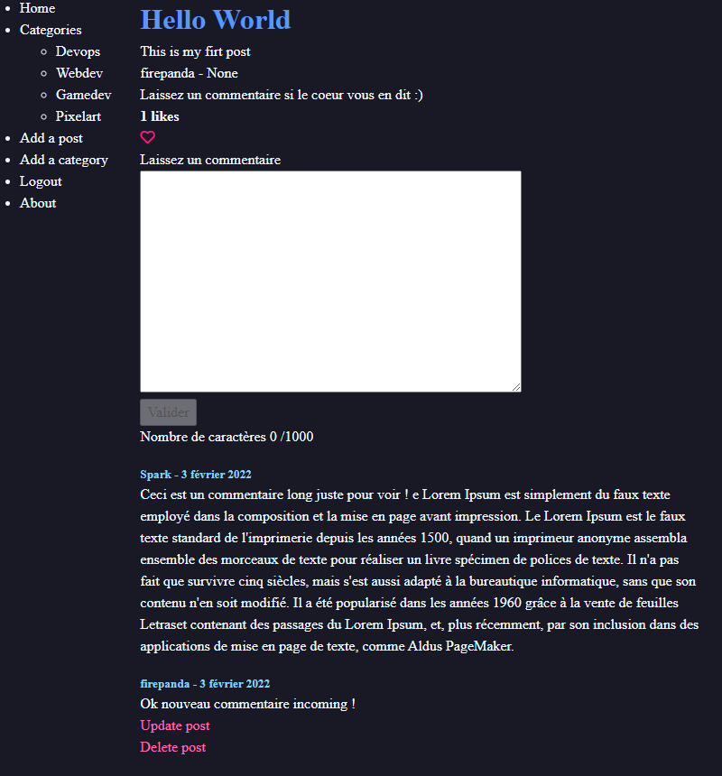

# <span style="color:#3D9CFA">Projet de blog Django avec Docker</span>

## <span style="color:#2DD6BA">Pour lancer l'application avec docker en production</span>

### Ce projet utilisera
* Gunicorn comme serveur WSGI
* Postgresql en base de données
* Whitenoise pour servir les fichiers statiques (sauf media)
* Traefik pour rediriger les requêtes vers l'application Django

### __Note :__

__> Pour la partie avec letsencrypt utiliser la version https du deploy__




### Marche à suivre

* Faire git clone du projet
* Créer un fichier .env sur base du .env.sample
* Modifier les fichiers Dockerfile et docker-compose pour mettre votre URL à la place de "app.localhost"
* Il faut avoir docker et docker-compose installés sur sa machine
* Jouer les commandes suivantes

```shell
docker-compose -f docker-compose-deploy.yml build
```

```shell
docker-compose -f docker-compose-deploy.yml up -d
```

```shell
docker-compose -f docker-compose-deploy.yml run --rm app sh -c "python manage.py createsuperuser"
```

Le site sera alors accessible via l'url "app.localhost" (ou via l'url choisie)

__>> En cas de modification du modèle de database il faudra faire un makemigration en local avant de re-builder__

__>> Attention si vous êtes sur windows avec git en clrf auto il faudra remettre le run.sh en LF avec notepad++ par exemple__

Le résultat final :



======================================================================


## <span style="color:#2DD6BA">Pour lancer l'application en local</span>

* Faire git clone du projet
* Créer un fichier .env sur base du .env.sample
* Créer un environnement virtuel

#### Windows

```shell
py -3 -m venv .venv
.venv\scripts\activate
```

#### Linux et macOS

```shell
python3 -m venv .venv
source .venv/bin/activate
```

* Se positionner dans le répertoire src
* Lancer l'installation des requirements


```shell
pip install -r requirements.txt
```

* Jouer les commandes suivantes l'une après l'autre

```shell
python manage makemigrations
```

```shell
python manage migrate
```

* Créer le super user

```shell
python manage createsuperuser
```

```shell
python manage runserver
```

<span style="color:#98D6FA">Le site est alors accessible via localhost:8000.</span>
